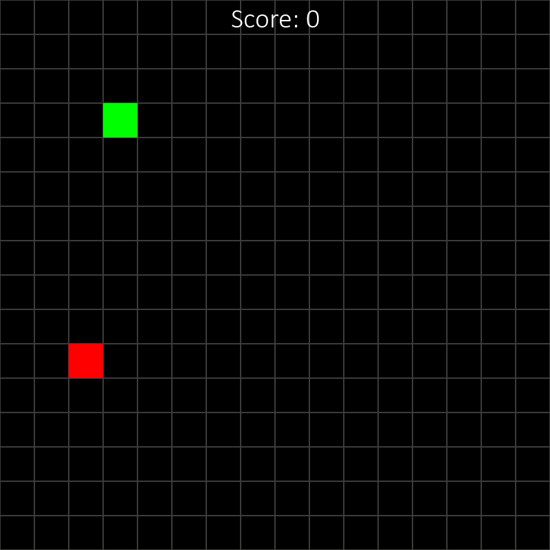

# Snake with PyGame
## Goal

The objective of this project is make a game environment of the classic game snake using the PyGame library that can be used to train reinforcement learning algorithms and also be able to play the game in normal fashion by the user.



## Game environment for training AI/ML algorithms

The game environment can be initialized by calling the `SnakeEnv` class:
```python
env = SnakeEnv(height=800, width=800, grid_size=50, max_steps=500)
```
By default, the game window is set to $800\times800$ px with grid spacing of $50$ px and each episode lasts a maximum of $500$ steps.

### Observation Space

The state of the game at any given time is given by,

)


\
where,
* $snake_{x_{position}}$ is the x coordinate of the snake head
* $snake_{y_{position}}$ is the y coordinate of the snake head
* $snake_{x_{direction}}$ is the direction in which,
    * +1 signifies the snake head is moving down
    * -1 signifies the snake head is moving up
    * 0 signifies the snake head is moving neither up or down
* $snake_{y_{direction}}$ is the direction in which,
    * +1 signifies the snake head is moving right
    * -1 signifies the snake head is moving left
    * 0 signifies the snake head is moving neither left or right

### Action space
There are four posible actions that can be takem, i.e. the snake can move up, down, left or right. The action space is given by the following table:

|    Action     |     Input     |
|---------------|---------------|
| Move up       |       1       |
| Move down     |       2       |
| Move left     |       3       |
| Move right    |       4       |


### Rewards

* For every apple eaten, $+1$ point is rewarded
* If the snake collides with itself, i.e. fails the game $-100$ points is awarded
* Otherwise no points are rewarded

### Functions

#### `reset()`

Calling the `reset()` function, resets the game environment and returns the following tuple of the initial game state. 
```python
state = env.reset()
```

#### `step(action)`

Calling the step function causes the game to advance by one step/one frame by taking the given action. It returns the *new state* of the game, the *reward* of the frame and the *done* flag,
```python
new_state, reward, done = env.step(action)
```

## Play the game
To play the game run the following command:
```console
cd Snake
```
and then 
```console
py -m game.py
```
